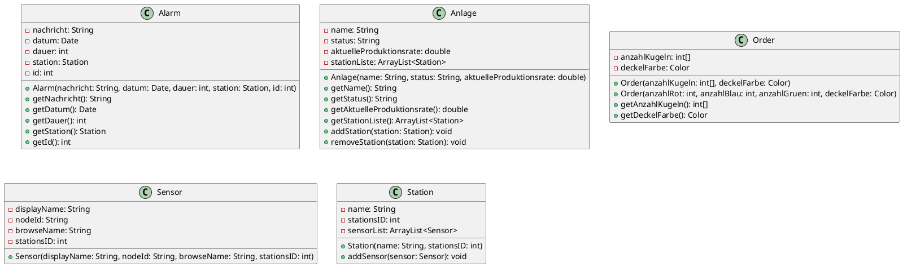

---
tags:
  - Berufsschule
  - LF7
---
Zurück zu [[Berufsschulstoff|Berufsschule-Inhaltsübersicht]]

a) _Um Sensoren und Aktoren nutzen zu können, müssen Sie in irgendeiner Art und Weise bereitgestellt werden. Hierfür wird das sogenannte Protokoll OPC UA genutzt. Listet alle Sensoren, die ihr gefunden habt (und vielleicht noch findet) in einer Liste auf._

- Näherungssensoren
- Magnetische Zylindersensoren
- Lichtsensor / Reflexionslicht-taster
- Positionssensor

b) _OPC UA basiert auf einer ganz bestimmten Architektur. Erläutert für die folgenden Schlagworte, was sie für OPC UA bedeuten und wie das Protokoll dort einzuordnen ist._
- Topologie
	- Sterntopologie
	- Point-to-Point
	- 
- Client-Server-Prinzip
	- Klare Trennung zwischen Clients und Servern
		- Client fordert Daten und initiiert Anfragen
		- Server liefert Daten 
- Konfiguration
	- Sicherheitseinstellungen
	- Datenzugriffsberechtigungen
	- Layer 4 Protokolle
- Sicherheit
	- Implementiert Sicherheitsstandards durch Signaturen für
		- Übertragung
		- Datenaustausch
	- Passwörter
	- Zertifikate

c) _Nutzt eine Software (am besten OPC Suite) auf den Schulrechnern, um euch mit einer der Anlagenteile mittels OPC UA zu verbinden. Könnt ihr auf den einzelnen Stationen alle Sensoren/Aktoren finden? Oder fällt euch etwas anderes auf?_

- Palettenlager @ 192.168.0.2
	- ![[Sensoren 5.png]]
	- ![[Sensoren 6.png]]
- Leitstand @ 192.168.0.200
	- Keine Sensoren gefunden
- Rohlager @ 192.168.0.10
	- ![[Sensoren 7.png]]
- Handling @ 192.168.0.20
	- ![[Sensoren 8.png]]
- Montagedemontage @ 192.168.0.30
	- ![[Sensoren 9.png]]
- Abfuellen @ 192.168.0.40
	- ![[Sensoren 10.png]]

Einige Sensoren wiederholen sich (bpsw. Bandsensor).

