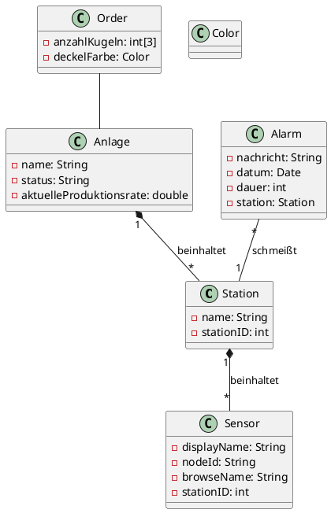

---
tags:
  - Berufsschule
  - LF7
title: 📖 Lernfeld 7 Übersicht 📖
---
Zurück zu [[Berufsschulstoff|Berufsschule-Inhaltsübersicht]]

| Thema |
|-------|
|[[00. Was ist Lernfeld 7]] |
|[[01. Maschinen Ablauf erklären]]       |
|[[02. OPC UA]]|

