---
tags:
  - Berufsschule
  - LF7
title: 📖 Lernfeld 7 Übersicht 📖
---
Zurück zu [[Berufsschulstoff|Berufsschule-Inhaltsübersicht]]

| Thema |
|-------|
|[[00. Was ist Lernfeld 7]] |
|[[01. Maschinen Ablauf erklären]]       |
|[[02. OPC UA]]|

```plantuml
@startuml

class Station {
  - name: String
  - stationID: int
}

class Sensor {
  - displayName: String
  - nodeId: String
  - browseName: String
  - stationID: int
}

class Anlage {
  - name: String
  - status: String
  - aktuelleProduktionsrate: double
}

class Order {
  - anzahlKugeln: int[3]
  - deckelFarbe: Color
}

class Alarm {
  - nachricht: String
  - datum: Date
  - dauer: int
  - station: Station
}

class Color

Station "1" *-- "*" Sensor : beinhaltet
Anlage "1" *-- "*" Station : beinhaltet
Alarm "*" -- "1" Station : schmeißt
Order -- Anlage

@enduml
```

