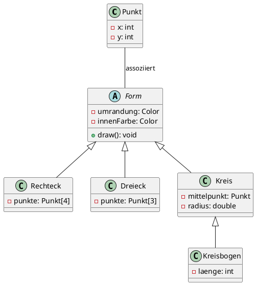

---
tags:
  - Berufsschule
  - LF8
draft: "false"
---
Zurück zu [[Berufsschulstoff|Berufsschul-Inhaltsübersicht]]

![[FS1 _ LA01 - Kunstwerk.pdf]]

![[Pasted image 20230927142055.png]]

```plantuml
@startuml 

class Punkt { 
- x: int
- y: int 
} 

abstract Form { 
- umrandung: Color 
- innenFarbe: Color 
+ draw(): void
} 

class Rechteck { 
- punkte: Punkt[4] 
}

class Dreieck {
- punkte: Punkt[3]
}

class Kreis { 
- mittelpunkt: Punkt 
- radius: double 
} 

class Kreisbogen {
- laenge: int
}

Punkt -- Form : assoziiert 
Form <|-- Rechteck 
Form <|-- Dreieck 
Form <|-- Kreis 
Kreis <|-- Kreisbogen

@enduml

```
