```plantuml
@startuml
package main.gui {
  class MeinPanel {
     - frame: JFrame
    - formList: List<Form>
    + MeinPanel(frame: JFrame)
    + paint(g: Graphics)
    + setFormList(formList: List<Form>)
  }
}

package main{
 class Main {
    - windowWidth: int
    - windowHeight: int
  }
}

package main.formen {
  class Punkt {
    - xCoord: int
    - yCoord: int
    + Punkt(xCoord: int, yCoord: int)
    + getxCoord(): int
    + getyCoord(): int
  }

  enum FormEnum {
    CIRCLE
    TRIANGLE
    SQUARE
  }

  abstract class Form {
    - umrandung: Color
    - innenFarbe: Color
    - punkte: Punkt[]
    + Form(umrandung: Color, innenFarbe: Color, punkte: Punkt[])
    + getPunkte(): Punkt[]
    + getUmrandung(): Color
    + getInnenFarbe(): Color
    + draw(graphics2D: Graphics2D)
    + fill(graphics2D: Graphics2D)
  }

  class FormGenerator {
    - randomizer: Random
    + createRandomTriangle(x_limit: int, y_limit: int): Dreieck
    + createRandomCircle(x_limit: int, y_limit: int): Kreis
    + createRandomRechteck(x_limit: int, y_limit: int): Rechteck
    + createRandomPoint(x_limit: int, y_limit: int): Punkt
    + generateRandomColor(): Color
    + generateFormList(formType: FormEnum, x_limit: int, y_limit: int): List<Form>
    + generateRandomFormList(x_limit: int, y_limit: int): List<Form>
  }
}

package main.formen.impl {
  class Rechteck {
    + Rechteck(a: Punkt, b: Punkt, c: Punkt, umrandung: Color, innenFarbe: Color)
    + draw(g2d: Graphics2D)
    + fill(g2d: Graphics2D)
  }

  class Kreisbogen {
    + Kreisbogen(mittelpunkt: Punkt, radius: int, umrandung: Color, innenFarbe: Color)
  }

  class Kreis {
    - radius: int
    + Kreis(mittelpunkt: Punkt, radius: int, umrandung: Color, innenFarbe: Color)
    + getRadius(): int
    + draw(g2d: Graphics2D)
    + fill(g2d: Graphics2D)
  }

  class Dreieck {
    + Dreieck(a: Punkt, b: Punkt, c: Punkt, umrandung: Color, innenFarbe: Color)
    + fill(g2d: Graphics2D)
    + draw(g2d: Graphics2D)
  }
}


Main --|> MeinPanel
MeinPanel --|> JPanel

Form *-- Punkt
Rechteck --|> Form
Kreis --|> Form
Dreieck --|> Form
Kreisbogen --|> Kreis
@enduml
```

---
tags:
  - Berufsschule
  - LF8
draft: "false"
---
Zurück zu [[Berufsschulstoff|Berufsschul-Inhaltsübersicht]]

![[FS1 _ LA01 - Kunstwerk.pdf]]

## Erster Draft - Grober Plan
![[UML Bildaufgabe.png]]

## Zweiter Draft - Erweiterung + Realisierung

![[Pasted image 20231206124031.png]]

### Code

```java
public class Dreieck extends Form {  
  
	public Dreieck(Punkt a, Punkt b, Punkt c, Color umrandung, Color innenFarbe){  
		super(umrandung, innenFarbe, new Punkt[]{a, b, c});  
	}  
  
	@Override  
	public void fill(Graphics2D g2d) {}  
  
	@Override  
	public void draw(Graphics2D g2d) {}  
  
}

public class Kreis extends Form {  
	private final int radius;  
	  
	public Kreis(Punkt mittelpunkt, int radius, Color umrandung, Color innenFarbe){  
		super(umrandung, innenFarbe, new Punkt[]{mittelpunkt});  
		this.radius=radius;  
	}  
	  
	public int getRadius(){  
		return this.radius;  
	}  
	  
	@Override  
	public void draw(Graphics2D g2d) {  
	  
	}  
	  
	@Override  
	public void fill(Graphics2D g2d){  
	  
	}  
}
```

```java  
public class Kreis extends Form {  
	private final int radius;  
  
	public Kreis(Punkt mittelpunkt, int radius, Color umrandung, Color innenFarbe){  
		super(umrandung, innenFarbe, new Punkt[]{mittelpunkt});  
		this.radius=radius;  
	}  
	  
	public int getRadius(){  
	return this.radius;  
	}  
  
	@Override  
	public void draw(Graphics2D g2d) {  
	  
	}  
  
	@Override  
	public void fill(Graphics2D g2d){  
	  
	}  
}
```

```java
public class Kreisbogen extends Kreis{  
  
	public Kreisbogen(Punkt mittelpunkt, int radius, Color umrandung, Color innenFarbe) {  
		super(mittelpunkt, radius, umrandung, innenFarbe);  
	}  
}
```

```java 
public class Rechteck extends Form {  
  
	public Rechteck(Punkt a, Punkt b, Punkt c, Color umrandung, Color innenFarbe){  
		super(umrandung, innenFarbe, new Punkt[]{a,b,c});  
	}  
  
	@Override  
	public void draw(Graphics2D g2d) {  
	}  
  
	@Override  
	public void fill(Graphics2D g2d) {  
	}  
}
```

```java
public abstract class Form{  
	private final Color umrandung;  
	private final Color innenFarbe;  
	  
	private final Punkt[] punkte;  
	  
	public Form(Color umrandung, Color innenFarbe, Punkt[] punkte){  
		this.innenFarbe=innenFarbe;  
		this.umrandung=umrandung;  
		this.punkte = punkte;  
	}  
	  
	public Punkt[] getPunkte() {  
		return punkte;  
	}  
	  
	public Color getUmrandung(){  
		return umrandung;  
	}  
	  
	public Color getInnenFarbe(){  
		return innenFarbe;  
	}  
	  
	public abstract void draw(Graphics2D graphics2D);  
	  
	public abstract void fill(Graphics2D graphics2D);
```

```java
public class Punkt {  
	private final int xCoord;  
	private final int yCoord;  
  
	public Punkt(int xCoord,int yCoord){  
		this.yCoord=yCoord;  
		this.xCoord=xCoord;  
	}  
  
	public int getxCoord(){  
		return xCoord;  
	}  
  
	public int getyCoord(){  
		return yCoord;  
	}  
}
```

```java
public class MeinPanel extends JPanel {  
  
	@Override  
	public void paint(Graphics g) {  
	//Hier wird gezeichnet  
	}  
}
```

## Dritter Draft + Implementierung

//Bild hier

![[Pasted image 20231206130654.png]]


### Code


