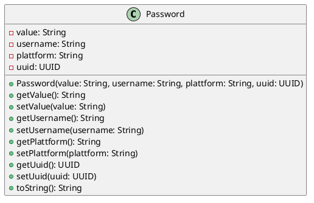

Back to [[Table of Contents]]
## Was macht die Password Entity

Die Password Klasse dient dazu alle nötigen Daten des jeweiligen Daten in einem Objekt festzuhalten und den Umgang mit diesem zu erleichtern

## UML

