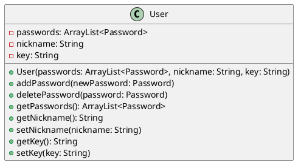

Back to [[Table of Contents]]

## Was macht die User Entität

Die User Klasse dient dazu den User abzubilden und dessen Daten an einem Platz zu haben.

## UML 

```plantuml
@startuml

class User {
  -passwords: ArrayList<Password>
  -nickname: String
  -key: String
  +User(passwords: ArrayList<Password>, nickname: String, key: String)
  +addPassword(newPassword: Password)
  +deletePassword(password: Password)
  +getPasswords(): ArrayList<Password>
  +getNickname(): String
  +setNickname(nickname: String)
  +getKey(): String
  +setKey(key: String)
}

@enduml

```
