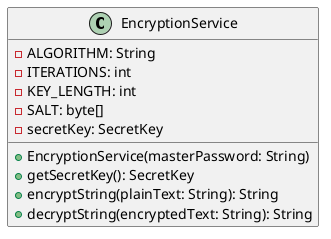

## Was ist der Encryption Service

Der Encryption Service ist für alles was die Verschlüsselung angeht verantwortlich.

Er generiert ein Schlüssel basierend auf dem Passwort des Users und verschlüsselt sämtliche Daten des Users mit diesem.

## UML

