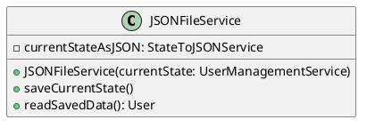

Back to [[Table of Contents]]

Der JSON File Service nimmt den aktuellen Stand des Users im JSON Format und speichert diesen in eine JSON Datei ab. Außerdem kann er den aktuellen Stand aus einer JSON lesen, ein User Objekt daraus bauen und dieses zurückgeben.
## UML 

