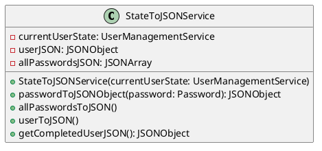

Back to [[Table of Contents]]

## Was macht der State to JSON Service

Der State zu JSON Service kümmert sich um die Konvertierung des aktuellen User States in ein JSON Format.

## UML

```plantuml
@startuml

class StateToJSONService {
  -currentUserState: UserManagementService
  -userJSON: JSONObject
  -allPasswordsJSON: JSONArray
  +StateToJSONService(currentUserState: UserManagementService)
  +passwordToJSONObject(password: Password): JSONObject
  +allPasswordsToJSON()
  +userToJSON()
  +getCompletedUserJSON(): JSONObject
}

@enduml
```
