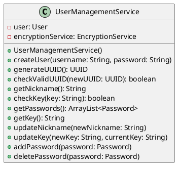

## Was ist der User Management Service ?

Der UMS kümmert sich um die Verwaltung der Daten des Users. Er gibt die Daten dort weiter wo sie benötigt werden und speichert diese. 

## UML

```plantuml
@startuml

class UserManagementService {
  -user: User
  -encryptionService: EncryptionService
  +UserManagementService()
  +createUser(username: String, password: String)
  +generateUUID(): UUID
  +checkValidUUID(newUUID: UUID): boolean
  +getNickname(): String
  +checkKey(key: String): boolean
  +getPasswords(): ArrayList<Password>
  +getKey(): String
  +updateNickname(newNickname: String)
  +updateKey(newKey: String, currentKey: String)
  +addPassword(password: Password)
  +deletePassword(password: Password)
}

@enduml
```
